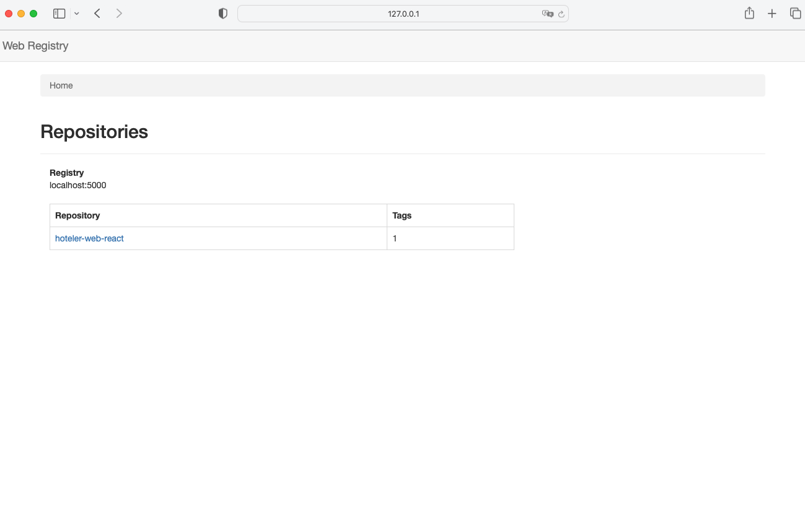

# private docker register deploy

## setup 

```
docker-compose up
```

## rename docker tag

```
docker tag hoteler-web-react:fa5cce2 127.0.0.1:5001/hoteler-web-react:fa5cce2
```

> hoteler-web-react:fa5cce2 is only on mylocal.

## push your docker

```
docker push 127.0.0.1:5001/hoteler-web-react:fa5cce2
```

## register ui

open `http://127.0.0.1:8000` in your web brower:

